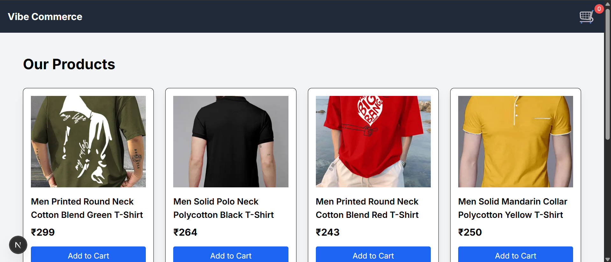

# Vibe Commerce - Full Stack Cart Assignment

**Submitted by:** Chaitanya Lohani

---

## Project Overview

Vibe Commerce is a full-stack e-commerce cart application built as part of a company screening assignment. The project demonstrates a complete shopping cart experience using the latest Next.js App Router, React Context API for state management, and a MongoDB backend. It fulfills all assignment requirements, including product display, cart management, and a mock checkout process.

---

## Tech Stack Used

- **Framework:** Next.js (App Router)
- **Frontend:** React, Tailwind CSS, Axios, React Context API
- **Backend:** Next.js API Routes (Node.js)
- **Database:** MongoDB (using Mongoose)

---

## Features Implemented

### Backend API Endpoints

- `GET /api/products`: Serves a list of mock products.
- `GET /api/cart`: Fetches all items from the MongoDB cart.
- `POST /api/cart`: Adds an item to the cart (handles quantity updates for existing items).
- `DELETE /api/cart/[id]`: Deletes a specific item from the cart.
- `POST /api/checkout`: Calculates the total, returns a mock receipt, and clears the cart in the database.

### Frontend Features

- Products page that fetches and displays all products.
- "Add to Cart" functionality that updates a global cart state.
- Navbar component that shows the real-time cart item count using React Context.
- Dedicated `/cart` page that lists all cart items, shows the total, and allows users to delete items.
- `/checkout` page with a form, order summary, and a mock receipt page upon successful submission.

---

## How to Run the Project Locally

1. **Clone the repository:**
	```sh
	git clone <repository-url>
	cd nexora-assignment
	```
2. **Create a `.env.local` file in the root and add your MongoDB connection string:**
	```env
	MONGODB_URI=your_mongodb_connection_string
	```
3. **Install dependencies:**
	```sh
	npm install
	```
4. **Run the development server:**
	```sh
	npm run dev
	```
	The app will be available at [http://localhost:3000](http://localhost:3000) (or another port if 3000 is in use).

---

## Screenshots

**Products Page**


**Cart Page**


**Checkout Page**
 

**Recipt Page**
 

---

## Demo Video

## Demo Video

[Click here to watch the 5-minute project demo](https://youtu.be/oaU1lFMdXy0?si=ERv7LLn_zMcmMY77)

---

Thank you for reviewing my submission!
